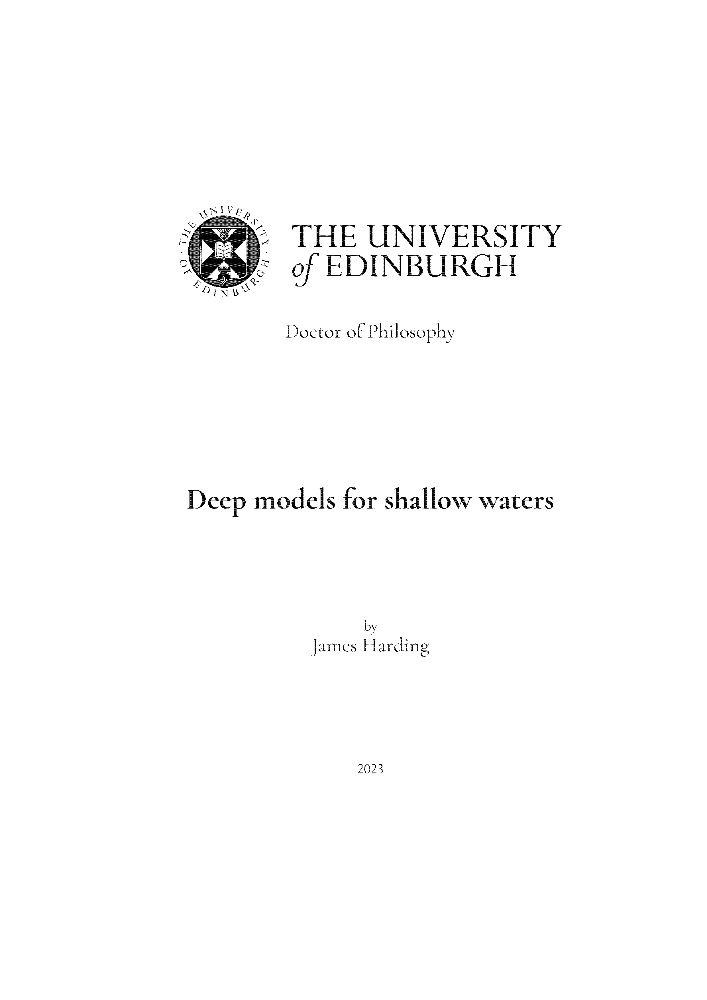
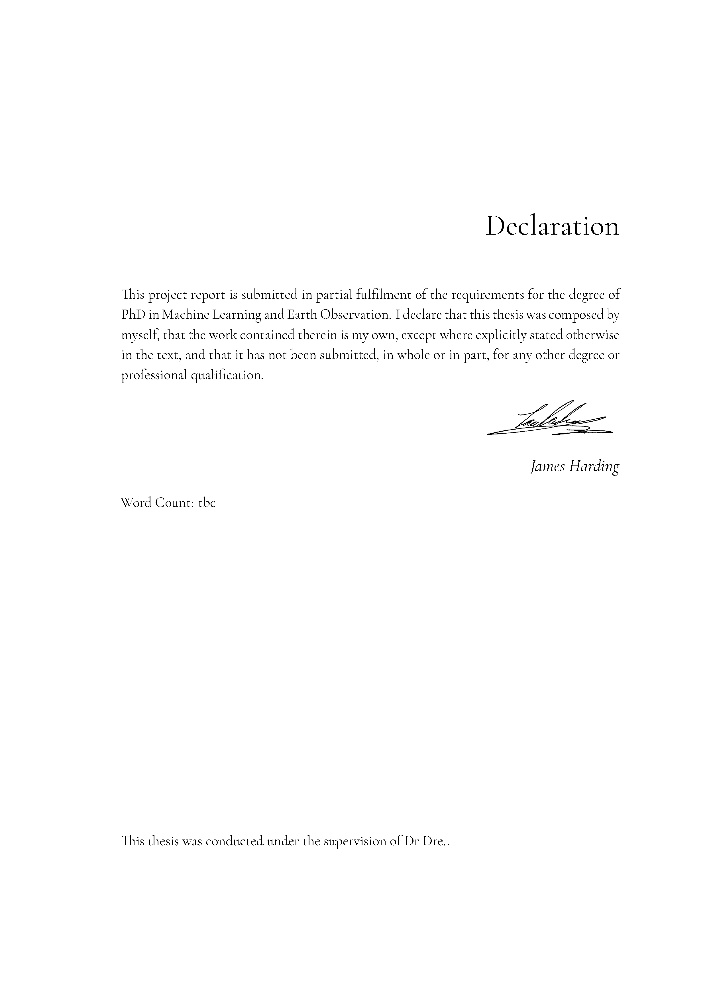
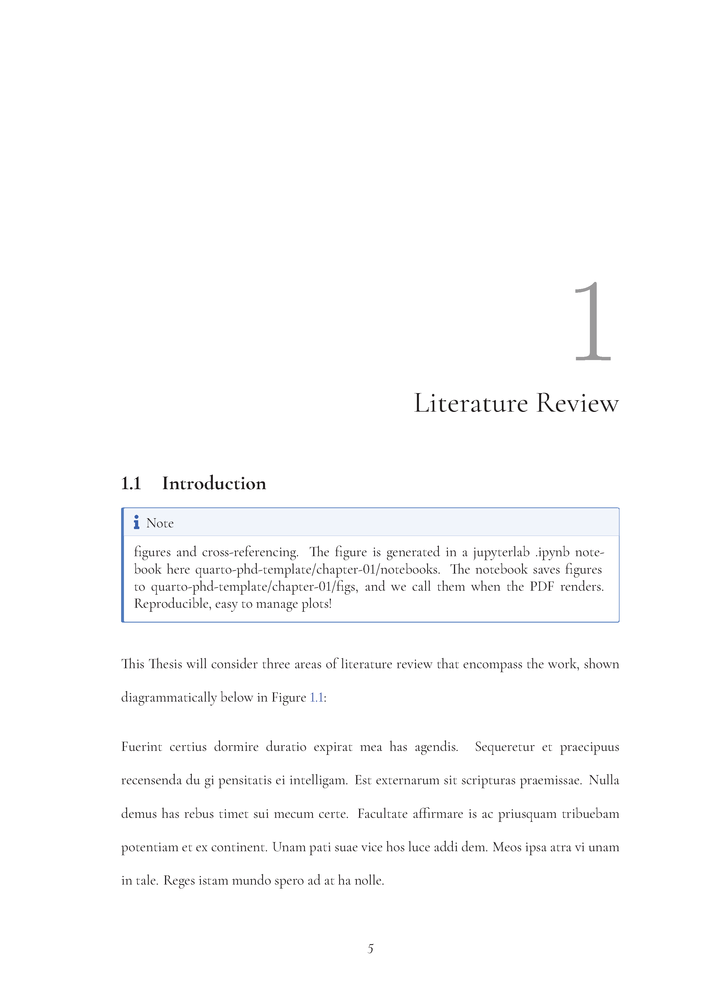
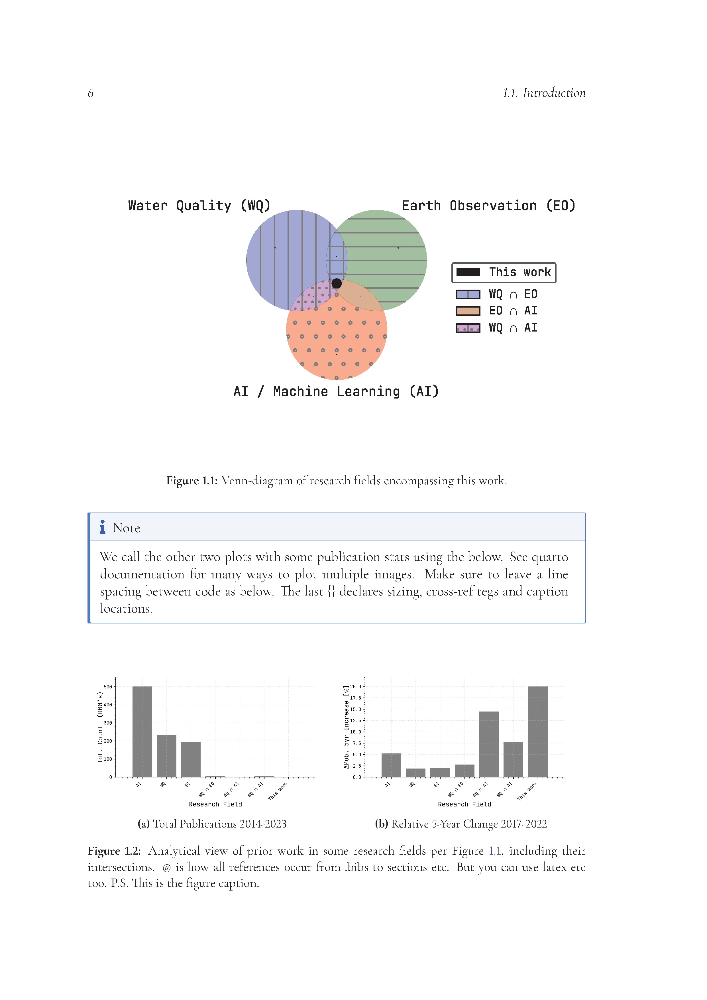

# readme.md

# Quarto Template PhD Thesis - Edinburgh University 

<div style="display: flex; flex-wrap: wrap; justify-content: space-between;">
  
  
  
  
</div>

This repository contains a Quarto template - PhD thesis at the University of Edinburgh. It can be adapted for general use; for other institutions; or for similar use cases such as Masters Dissertations or Theses.

[PDF preview available here](_book/quarto-phd-template.pdf) 

## Introduction

Quarto is a flexible tool for integrating various file markdownlanguages and computational code in a single docuemnt, including .ipynb, .qmd, .md, and .txt.

This Thesis template uses Roman numeral page numbering for front matter sections and Arabic numeral page numbering for the main content. Page numbering counter starts on page 3 to skip the cover sheet, you can comment that out in before-body.tex. Dedication, Title-page, declaration, abstract and acknowledgements are optional. The template also allows glossaries to be written in Markdown (I find it much simpler), but distributes TOCs, LOTs, LOFs to latex (also simplere/more flexible). Example Glossary of abbreviations, symbols, and definitions are within. The table of contents, list of figures, and list of tables can be commented out within the toc.tex file. before-body.tex can be used to drop whatever preamble sections you won't need. 

## Repository / Thesis Structure
The repository is organized to mirror the structure of the thesis document. The index.qmd and _quarto.yml files can be edited as needed, but they cannot be deleted or renamed. The following diagram provides an overview of the template structure. Consult the code in the repository for a better understanding of how Quarto ties everything together. You can call the code-cell in create-chapter.ipynb to generate new chapters and associated resource folders (see Chapter 1 example). The ascii-dir script reates repository structure drawingls like that below.

```python
├── _book/
│   └── uoe-thesis.pdf         # calling quarto render from terminal produces your thesis here
├── _configs/                  # A folder for global config files; reproducible/consistent plots all Thesis 
│   └── matplotlibrc.txt       # I just use matplotlibrc.txt as an example for nice graphs 
├── chapter-00/                # Chapter content is organised into chapter folders, this introduction chapter is unnumbered
│   └── _introduction.qmd      # _chapter-name.qmd are the files I use to compile sections, figures, tables etc.
├── chapter-01/                # Chapter 1 folder; example of breaking up .qmd files into sections
│   ├── 01-intro.qmd           # Chapter 1: Section 1
│   ├── 02-wq.qmd              # Chapter 1: Section 2, and so on...
│   ├── 03-eo.qmd              # Sections use figures, code, notebook-outputs, etc. from /figs, /tables below
│   ├── 05-ai.qmd
│   ├── _literature-review.qmd # Sections are compiled in _literature-review.qmd
│   ├── figs/                  # Figures resource for Chapter 1
│   ├── images/
│   ├── litreview.qmd
│   ├── notebooks/             # .ipynb notebooks generate outputs -> /tables or /figs -> sections -> _lit-review.qmd
│   └── tables/                # You can skip any or all steps
├── chapter-02/                # Not everyone will need the full suite of Quarto abilities in chapter-01, that's okay
│   └── _materials&methods.qmd # Chapter 2 demonstrates simple use cases
├── chapter-03/                # Delete any folders or sections you don't need, except...
│   ├── _chapter-title.qmd     # ...this one; _chapter-title file is where the content goes
│   ├── _chapter-title.md      # The .qmd files can be changed to your preferred code format
│   ├── _chapter-title.ipynb   # Mix .tex, .md, .py in a single JupyterLab
│   ├── _chapter-title.tex     # Or pick your favorite, such as .tex
├── _quarto.yml                # Define the correct _chapter-title files in the right order in this .yml file
├── endmatter/                 # Includes appendix and .bibs for references or bibliographies needed
│   ├── appendices/            # Folder for appenices. Below bibliography folder holds the .bib file(s) and references.qmd
│   ├── bibliography/          # References.qmd simple calls the references to be made, you can decide where in the _quarto.yml
├── frontmatter/               # The frontmatter will be more familiar to most
│   ├── 01-dedication.txt
│   ├── 02-declaration.txt
│   ├── 03-abstract.txt
│   ├── 04-acknowledgements.txt
│   ├── before-body.tex        # This folder's content defines the template styling, similar to Overleaf
│   ├── figs/                  # This /figs contains title page images, etc.
│   ├── header.tex             # This is the LaTeX preamble called before "/begindocument{}"
│   ├── title.tex              # Defines variables from the .yml file for use in the title page
│   └── toc.tex                # Contains the TOC, LOF, LOTs, which you can delete as required
```

## Usage

1. Clone this repository or download it as a ZIP archive.
2. Customize the template to fit your specific requirements by modifying the content in the frontmatter, chapter-*, and endmatter folders. 
3. Modify the _configs file to format graph or figure styling (see Chapter 1 for examples)
4. Run the create-chapter.ipynb notebook to generate new chapter folders and resource folders as needed.
5. Use the ascii-dir script to visualize the structure of your repository at single or full levels.
6. Call quarto render in the terminal in the main directory.

## Requirements

This template requires Quarto and LaTeX to be installed on your system. Please refer to the Quarto documentation and LaTeX project website for installation instructions. 

## License

This template is released under the MIT License.
